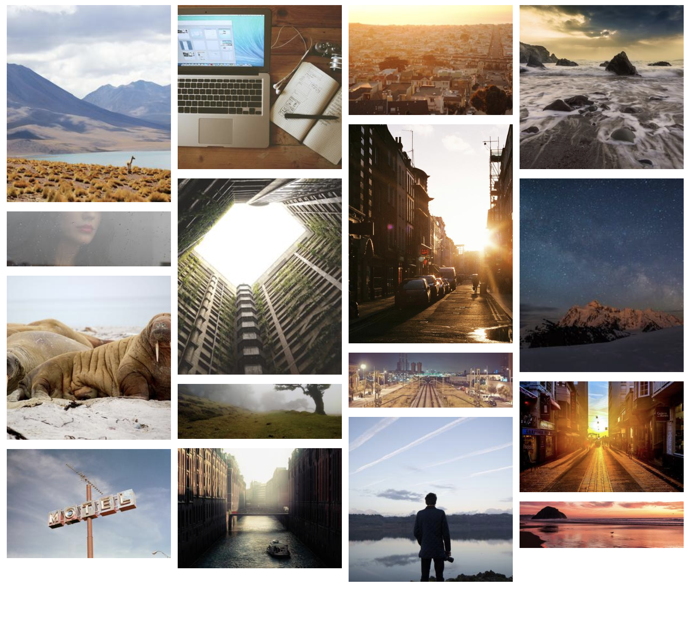

### Large

#### Responsive Image Gallery

Create a responsive image gallery using the Grid Layout

- 1 column for the default (mobile)
- 2 columns for screens over 400px and under 799px wide
- 4 columns for screens over 800px wide
- Use the [Lorem Picsum](https://picsum.photos/) service to generate images
- Set the images to `width: 100%`, `height: auto` to fill the images into the columns
- Add even padding on all sides of the grid cells (there is more than one way to achieve this)