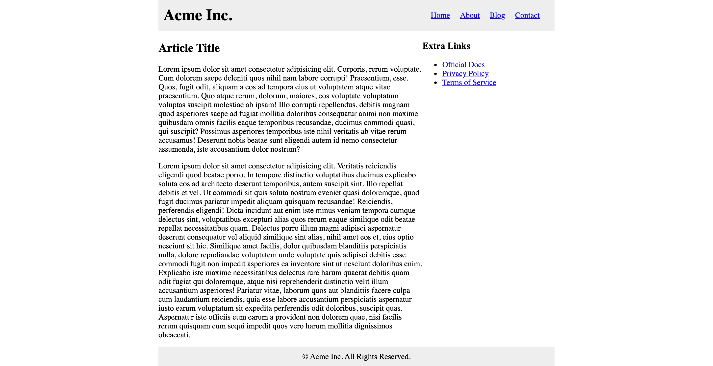

### Medium

#### Blog Layout

Create a basic blog layout page using Grid Layout with the following properties:

- Max width of 800px (centered)
- The header, main content, sidebar and footer should all be in one grid container and positioned manually
- The header menu can be aligned with flexbox

Here is a preview of what it should look like:

