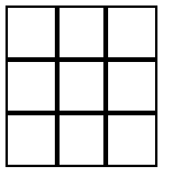

### Tick-Tac-Toe Board

Create a 3 x 3 tick-tack-toe board using Grid Layout.

- Make a _html_ file called "tic-tac-toe"
- Make a _styles_ sheet and link it to your _html_
- Create your Board using _div_ tags
- Make each tile 50x50 pixels
- Use `border: 3px solid black;` to create board effect (you can leave the outside border)

